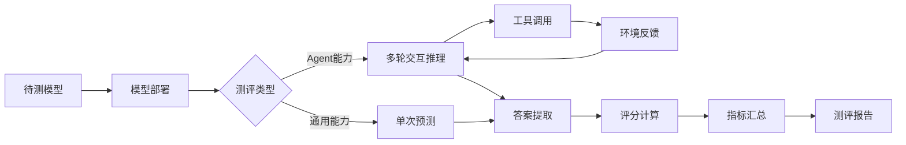

# AFM 模型测评完整使用手册

## 目录
1. [测评体系概览](#测评体系概览)
2. [测评架构与流程](#测评架构与流程)
3. [数据集与数据格式](#数据集与数据格式)
4. [评分机制详解](#评分机制详解)
5. [Agent 专业能力测评](#agent-专业能力测评)
6. [通用能力测评](#通用能力测评)
7. [完整测评实战指南](#完整测评实战指南)

---

## 测评体系概览

AFM 项目采用**双轨测评体系**：

### 1. Agent 专业能力测评（核心）
测评模型在特定领域的 Agent 能力，包括：
- **MHQA Agent**：多跳问答能力（Multi-Hop QA）
- **Code Agent**：代码生成与执行能力
- **Web Agent**：网页交互与信息检索能力

### 2. 通用能力测评（辅助）
通过学术基准测试模型的通用语言理解能力：
- **MMLU**：大规模多任务语言理解
- **C-Eval**：中文综合能力评估
- **CMMLU**：中文多任务理解

---

## 测评架构与流程

### 整体架构图

```
┌─────────────────────────────────────────────────────────────┐
│                      AFM 测评系统                             │
├─────────────────────────────────────────────────────────────┤
│                                                               │
│  ┌───────────────────┐        ┌──────────────────────┐      │
│  │  Agent 专业测评    │        │   通用能力测评        │      │
│  └───────────────────┘        └──────────────────────┘      │
│           │                            │                      │
│           ├─ MHQA Agent                ├─ MMLU               │
│           │   ├─ NQ                    ├─ C-Eval            │
│           │   ├─ HotpotQA              └─ CMMLU             │
│           │   └─ 2WikiMQA                                    │
│           │                                                   │
│           ├─ Code Agent                                      │
│           │   ├─ LiveCodeBench                               │
│           │   ├─ MBPP                                        │
│           │   └─ MATH                                        │
│           │                                                   │
│           └─ Web Agent                                       │
│               ├─ GAIA                                        │
│               ├─ WebWalker                                   │
│               └─ BrowseComp                                  │
│                                                               │
└─────────────────────────────────────────────────────────────┘
```

### 核心测评流程



---

## 数据集与数据格式

### 1. MHQA Agent 数据格式

**数据集位置**：`AFM/data/mhqa_agent/test_benchmarks/`

**标准格式**（JSONL）：
```json
{
  "question": "问题文本",
  "target": ["答案1", "答案2", "答案3"],  // 多个可接受答案
  "data_source": "nq",  // 数据来源：nq/hotpotqa/2wikimultihopqa
  "level": "medium",    // 难度级别（可选）
  "context": ["相关文档1", "相关文档2"]  // 背景文档（可选）
}
```

**支持的数据集**：
- `nq_full.jsonl`：Natural Questions
- `hotpotqa_full.jsonl`：HotpotQA
- `2wikimultihopqa_full.jsonl`：2WikiMultihopQA

### 2. Code Agent 数据格式

**数据集位置**：`AFM/data/code_agent/code_math_benchmarks/`

**LiveCodeBench 格式**（Parquet）：
```python
{
  "question_id": "lcb_001",
  "question_title": "Two Sum",
  "question_content": "给定一个整数数组...",
  "test_cases": [
    {"input": "[2,7,11,15], 9", "output": "[0,1]"},
    {"input": "[3,2,4], 6", "output": "[1,2]"}
  ],
  "difficulty": "easy",
  "constraints": ["1 <= nums.length <= 10^4"],
  "starter_code": "def twoSum(nums, target):\n    pass"
}
```

**MATH 数据集格式**：
```json
{
  "problem": "计算 \\int_{0}^{\\pi} \\sin(x) dx",
  "solution": "使用积分公式...",
  "answer": "2",
  "level": "Level 4",
  "type": "Calculus"
}
```

### 3. Web Agent 数据格式

**输入格式**（JSONL）：
```json
{
  "question_id": "gaia_001",
  "question": "Find the current CEO of Microsoft and their education background",
  "answer": "Satya Nadella, University of Wisconsin-Milwaukee (BS), University of Chicago (MBA)",
  "Level": "2",  // GAIA 难度等级：1-3
  "metadata": {
    "category": "information_retrieval",
    "requires_tools": ["web_search", "crawl_page"]
  }
}
```

**输出格式**（带轨迹）：
```json
{
  "question_id": "gaia_001",
  "question": "...",
  "golden_answer": "...",
  "prediction": "模型预测答案",
  "llm_judge": 1,  // 0或1
  "status": "completed",  // completed/error/invalid_format
  "steps": [
    {
      "type": "think",
      "content": "<think>需要搜索 Microsoft CEO 信息</think>"
    },
    {
      "type": "web_search",
      "content": "<web_search>Microsoft CEO</web_search>\n<observation>搜索结果...</observation>"
    },
    {
      "type": "answer",
      "content": "<answer>Satya Nadella...</answer>"
    }
  ]
}
```

### 4. 通用能力测评数据格式

**MMLU/C-Eval/CMMLU 格式**（CSV）：
```csv
question,A,B,C,D,answer,subject
"人工智能的定义是什么？","符号操作","机器学习","模拟人类智能","数据分析","C","computer_science"
```

---

## 评分机制详解

### 1. Exact Match (EM) 评分

**适用场景**：MHQA、QA 任务

**核心逻辑**：
```python
def normalize_answer(text):
    """标准化答案：去除冠词、标点、小写化"""
    text = re.sub(r"\b(a|an|the)\b", " ", text.lower())
    text = "".join(ch for ch in text if ch not in string.punctuation)
    return " ".join(text.split())

def em_check(prediction, golden_answers):
    """精确匹配检查"""
    normalized_pred = normalize_answer(prediction)
    for golden in golden_answers:
        if normalize_answer(golden) == normalized_pred:
            return 1.0
    return 0.0
```

**评分规则**：
- 完全匹配任一标准答案：`score = 1.0`
- 未找到答案或格式错误：`score = 0.0`
- 支持多个可接受答案（任一匹配即可）

**实现位置**：
- `verl/verl/utils/reward_score/qa_em.py`
- `verl/verl/utils/reward_score/mhqa_eval.py`

### 2. LLM Judge 评分

**适用场景**：开放性问题、需要语义理解的任务

**评分流程**：
```python
async def llm_judge_single(question, pred_answer, gt_answer):
    """使用 LLM 作为评判者"""
    prompt = f"""
Question: {question}
Ground Truth: {gt_answer}
Prediction: {pred_answer}

Is the prediction correct? Reply with JSON:
{{"judgement": "correct" or "incorrect", "reason": "..."}}
"""
    response = await llm_api_call(prompt)
    return 1.0 if response['judgement'] == 'correct' else 0.0
```

**混合评分**（GRM）：
```python
score = 0.1 * format_score + 0.9 * llm_judge_score
```

**实现位置**：
- `verl/verl/utils/reward_score/llm_judge.py`
- `verl/verl/utils/reward_score/grm_simple.py`

### 3. Code Execution 评分

**适用场景**：代码生成任务

**评分维度**：
```python
def compute_code_score(code, test_cases):
    # 1. 格式检查（10%权重）
    format_score = verify_code_format(code)
    
    # 2. 测试用例通过率（90%权重）
    passed, total = 0, len(test_cases)
    for test_case in test_cases:
        if execute_code(code, test_case):
            passed += 1
    
    execution_score = passed / total
    
    # 3. 综合评分
    final_score = 0.1 * format_score + 0.9 * execution_score
    return final_score
```

**安全沙箱**：使用 nsjail 隔离执行环境

**实现位置**：
- `verl/verl/utils/reward_score/livecodebench/`
- `verl/verl/utils/reward_score/mbpp.py`

### 4. Format Reward

**格式验证规则**：
```python
def verify_format(response):
    """检查是否包含必需的标签"""
    required_tags = ['<answer>', '</answer>']
    has_answer = all(tag in response for tag in required_tags)
    
    # 检查标签嵌套是否正确
    if has_answer:
        matches = re.findall(r'<answer>(.*?)</answer>', response, re.DOTALL)
        return len(matches) > 0
    return False
```

---

## Agent 专业能力测评

### 1. MHQA Agent 测评

#### 环境配置

```bash
# 1. 启动 Wiki 搜索服务器
cd AFM/tool_servers/wiki_server
bash start_wiki_server.sh

# 2. 配置工具路径
export WIKI_SEARCH="${PWD}/verl/verl/tools/config/search_tool_config/wiki_rag_config.yaml"
```

#### 测评脚本配置

**文件**：`AFM/evaluation/mhqa_agent/eval_mhqa_agent.sh`

**关键参数**：
```bash
# 模型路径
export BASE_MODEL="/path/to/AFM-MHQA-Agent-3B-rl"

# 数据集配置
TRAIN_DATASETS="/path/to/val_data.jsonl"  # 可与测试集相同
VAL_DATASETS="/path/to/test_data.jsonl"

# 推理参数
max_prompt_length=$((1024 * 2))      # 2K tokens
max_response_length=$((1024 * 8))    # 8K tokens
actor_rollout_ref.rollout.n=8        # 每题生成 8 个候选答案
actor_rollout_ref.rollout.temperature=1.0

# 多轮交互配置
actor_rollout_ref.rollout.multi_turn.enable=true
actor_rollout_ref.rollout.multi_turn.max_turns=8  # 最多8轮工具调用
actor_rollout_ref.rollout.multi_turn.format=qwen  # 使用 Qwen 格式

# 评分函数
custom_reward_function.val_path="verl/verl/utils/reward_score/mhqa_eval.py"
custom_reward_function.val_name="compute_score_em_batch"
```

#### 执行测评

```bash
cd /path/to/Agent_Foundation_Models

# 单节点 8 卡测评
export NNODES=1
bash AFM/evaluation/mhqa_agent/eval_mhqa_agent.sh
```

#### 结果分析

**输出位置**：
- 日志：`logs/eval_mhqa.log`
- 结果：`experiments/eval_mhqa/`

**关键指标**：
```python
# 从日志中提取
{
  "avg_score": 0.65,           # 平均 EM 分数
  "total_samples": 3611,       # 总样本数
  "correct": 2347,             # 正确数量
  "accuracy": 0.65,            # 准确率
  "avg_turns": 3.2,            # 平均交互轮数
  "tool_usage": {
    "wiki_search": 8234,       # 工具调用统计
    "finish": 3611
  }
}
```

### 2. Code Agent 测评

#### 环境准备

```bash
# 安装 nsjail（代码沙箱）
git clone https://github.com/google/nsjail.git
cd nsjail
make -j$(nproc)
sudo cp nsjail /usr/local/bin/

# 配置代码执行器
export CODE_CONFIG="${PWD}/verl/tools/config/code_tool_config/code_executor.yaml"
```

#### 测评配置

**文件**：`AFM/evaluation/code_agent/eval_code_agent.sh`

**关键参数**：
```bash
# 模型路径
export BASE_MODEL="/path/to/AFM-CodeAgent-7B"

# 上下文窗口（代码任务需要更长）
max_prompt_length=$((1024 * 4))      # 4K
max_response_length=$((1024 * 28))   # 28K

# 多轮调试
actor_rollout_ref.rollout.multi_turn.max_turns=12  # 允许多次尝试

# 代码工具配置
actor_rollout_ref.rollout.multi_turn.tool_config_path="$CODE_CONFIG"

# 评分（AFM reward manager）
reward_model.reward_manager="afm"
```

#### 执行测评

```bash
bash AFM/evaluation/code_agent/eval_code_agent.sh
```

#### LiveCodeBench 评分

**Pass@k 计算**：
```python
def pass_at_k(n, c, k):
    """
    n: 总生成数
    c: 通过数
    k: 取前 k 个
    """
    if n - c < k:
        return 1.0
    return 1.0 - (comb(n - c, k) / comb(n, k))
```

### 3. Web Agent 测评

#### 环境配置

```bash
# 1. 启动 Web 搜索服务器
cd AFM/tool_servers/web_server
bash start_web_server.sh

# 2. 启动页面爬取服务器
bash start_crawl_server.sh

# 3. 配置环境变量
export SERVER_HOST="localhost"
export WEBSEARCH_PORT="8001"
export CRAWL_PAGE_PORT="8002"
export SUMMARY_OPENAI_API_KEY="your_key"
export SUMMARY_OPENAI_API_BASE_URL="https://api.openai.com/v1"
export SUMMARY_MODEL="gpt-4"
```

#### 部署推理服务

**文件**：`AFM/evaluation/web_agent/run_qwen.sh`

```bash
# 部署 vLLM 服务
model_path="/path/to/AFM-WebAgent-32B-RL"
port=10000
GPUS_PER_INSTANCE=4

vllm serve ${model_path} \
    --served_model_name AFM-WebAgent-32B-RL \
    --max_model_len 32768 \
    --tensor_parallel_size ${GPUS_PER_INSTANCE} \
    --gpu_memory_utilization 0.7 \
    --port ${port}
```

#### 执行测评

**文件**：`AFM/evaluation/web_agent/inference_web_agent.py`

```bash
# 配置推理参数
python inference_web_agent.py \
    --infile /path/to/gaia_test.jsonl \
    --outfile /path/to/results/gaia_results.jsonl \
    --q-key question \
    --a-key answer

# 参数说明
# --infile: 测试数据文件
# --outfile: 结果输出文件
# --q-key: 问题字段名
# --a-key: 答案字段名
```

#### 推理流程

**多轮交互循环**：
```python
def process_single_data(query, max_turns=36):
    current_answer = ""
    for turn in range(max_turns):
        # 1. 模型生成下一步动作
        tag, content = request_service(system_prompt, query, current_answer)
        
        # 2. 根据 tag 执行不同操作
        if tag == "web_search":
            results = WebSearchTool(query=content)
            current_answer += f"{content}\n<observation>{results}</observation>"
        
        elif tag == "crawl_page":
            page_content = CrawlPageTool(urls=content)
            current_answer += f"{content}\n<observation>{page_content}</observation>"
        
        elif tag == "answer":
            # 提取最终答案
            final_answer = extract_answer(content)
            return final_answer
        
        # 3. 重复检测
        if is_duplicate(content, current_answer):
            current_answer += "Warning: Duplicate action detected"
```

#### LLM Judge 评分

```python
def evaluate_with_llm(question, prediction, golden_answer):
    """使用 GPT-4 作为评判者"""
    prompt = llm_evaluation_prompt.format(
        question=question,
        gt_answer=golden_answer,
        pred_answer=prediction
    )
    
    response = openai_client.chat.completions.create(
        model="gpt-4",
        messages=[{"role": "user", "content": prompt}]
    )
    
    judgement = json.loads(response.choices[0].message.content)
    return 1 if judgement['judgement'] == 'correct' else 0
```

---

## 通用能力测评

### 1. MMLU 测评

#### 数据准备

```bash
cd LLaMA-Factory/evaluation/mmlu
unzip mmlu.zip
```

#### 测评脚本

**使用 LLaMA-Factory 的评估功能**：

```bash
cd LLaMA-Factory

llamafactory-cli eval \
    --model_name_or_path /path/to/your/model \
    --template qwen \
    --task mmlu \
    --split test \
    --lang en \
    --n_shot 5 \
    --batch_size 4 \
    --output_dir ./eval_results/mmlu
```

#### 关键参数

```python
# 评估配置
{
  "n_shot": 5,              # Few-shot 样本数
  "batch_size": 4,          # 批处理大小
  "subjects": [             # 测试科目（可指定子集）
    "computer_science",
    "mathematics", 
    "physics",
    ...
  ]
}
```

### 2. C-Eval / CMMLU 测评

```bash
# C-Eval
llamafactory-cli eval \
    --model_name_or_path /path/to/your/model \
    --template qwen \
    --task ceval \
    --split val \
    --lang zh \
    --n_shot 5 \
    --batch_size 4

# CMMLU
llamafactory-cli eval \
    --model_name_or_path /path/to/your/model \
    --template qwen \
    --task cmmlu \
    --split test \
    --lang zh \
    --n_shot 5 \
    --batch_size 4
```

#### 结果格式

```json
{
  "dataset": "mmlu",
  "overall_accuracy": 0.672,
  "subject_scores": {
    "computer_science": 0.68,
    "mathematics": 0.71,
    "physics": 0.65,
    ...
  },
  "n_shot": 5,
  "total_questions": 14042
}
```

---

## 完整测评实战指南

### 测评前准备清单

#### 1. 环境检查

```bash
# 检查 GPU
nvidia-smi

# 检查 CUDA
nvcc --version

# 检查 Python 环境
conda env list
pip list | grep torch

# 检查磁盘空间（模型+数据至少需要 100GB）
df -h
```

#### 2. 模型准备

```bash
# 下载或链接模型文件
MODEL_DIR="/path/to/models"
mkdir -p $MODEL_DIR

# 检查模型文件完整性
ls -lh $MODEL_DIR/AFM-MHQA-Agent-3B-rl/
# 应包含：config.json, tokenizer.json, *.safetensors 等
```

#### 3. 数据集准备

```bash
# 下载测试数据
DATA_DIR="/path/to/data"
mkdir -p $DATA_DIR

# MHQA 数据
cd AFM/data/mhqa_agent
python download.py --output_dir $DATA_DIR/mhqa

# Code 数据
cd ../code_agent
python download.py --output_dir $DATA_DIR/code

# Web 数据（需要单独获取）
# GAIA/WebWalker 等数据集需要申请访问权限
```

### 测评执行流程

#### Step 1: 单一 Agent 快速验证

```bash
# 选择一个 Agent 进行小规模测试
cd /path/to/Agent_Foundation_Models

# 1. 修改测评脚本，使用小数据集
# 在 eval_mhqa_agent.sh 中设置：
VAL_DATASETS="$DATA_DIR/mhqa/nq_sample_100.jsonl"  # 仅 100 条

# 2. 执行测评
bash AFM/evaluation/mhqa_agent/eval_mhqa_agent.sh

# 3. 检查输出
tail -f logs/eval_mhqa.log

# 4. 验证指标
# 期望看到：
# - 模型成功加载
# - 工具调用正常
# - EM 分数在合理范围（0.5-0.8）
```

#### Step 2: 完整 Agent 测评

```bash
# 依次测评三个 Agent
for agent in mhqa code web; do
    echo "=== Testing ${agent} Agent ==="
    bash AFM/evaluation/${agent}_agent/eval_${agent}_agent.sh
done

# 监控进度
watch -n 10 "tail -20 logs/eval_*.log"
```

#### Step 3: 通用能力测评

```bash
cd LLaMA-Factory

# 按顺序执行
for task in mmlu ceval cmmlu; do
    llamafactory-cli eval \
        --model_name_or_path /path/to/model \
        --template qwen \
        --task $task \
        --output_dir eval_results/$task
done
```

### 结果收集与分析

#### 1. 提取关键指标

**创建分析脚本** `extract_metrics.py`：

```python
import json
import glob

def extract_mhqa_metrics(log_file):
    """从 MHQA 日志提取指标"""
    with open(log_file) as f:
        lines = f.readlines()
    
    metrics = {}
    for line in lines:
        if "avg_score" in line:
            metrics['em_score'] = float(line.split(':')[1].strip())
        elif "avg_turns" in line:
            metrics['avg_turns'] = float(line.split(':')[1].strip())
    
    return metrics

def extract_code_metrics(result_dir):
    """从 Code 测评结果提取指标"""
    results = []
    for file in glob.glob(f"{result_dir}/*.json"):
        with open(file) as f:
            results.append(json.load(f))
    
    total = len(results)
    passed = sum(1 for r in results if r['status'] == 'passed')
    
    return {
        'pass_rate': passed / total,
        'total': total,
        'passed': passed
    }

def extract_web_metrics(result_file):
    """从 Web Agent 结果提取指标"""
    with open(result_file) as f:
        results = [json.loads(line) for line in f]
    
    total = len(results)
    correct = sum(r['llm_judge'] for r in results)
    
    return {
        'accuracy': correct / total,
        'total': total,
        'correct': correct
    }

# 使用示例
mhqa_metrics = extract_mhqa_metrics('logs/eval_mhqa.log')
code_metrics = extract_code_metrics('experiments/eval_code/')
web_metrics = extract_web_metrics('results/gaia_results.jsonl')

print("=== MHQA Agent ===")
print(f"EM Score: {mhqa_metrics['em_score']:.2%}")

print("\n=== Code Agent ===")
print(f"Pass Rate: {code_metrics['pass_rate']:.2%}")

print("\n=== Web Agent ===")
print(f"Accuracy: {web_metrics['accuracy']:.2%}")
```

#### 2. 生成测评报告

**报告模板**：

```markdown
# AFM 模型测评报告

## 模型信息
- 模型名称：AFM-7B-v1
- 基座模型：Qwen2.5-7B
- 训练类型：SFT + RL
- 测评日期：2025-11-04

## Agent 专业能力

### MHQA Agent
| 数据集      | EM Score | Avg Turns | Sample Size |
|------------|----------|-----------|-------------|
| NQ         | 68.5%    | 3.2       | 3,610       |
| HotpotQA   | 62.3%    | 4.1       | 7,405       |
| 2WikiMQA   | 58.7%    | 4.5       | 12,576      |
| **平均**    | **63.2%**| **3.9**   | **23,591**  |

### Code Agent
| 数据集           | Pass@1 | Pass@3 | Sample Size |
|-----------------|--------|--------|-------------|
| LiveCodeBench   | 24.5%  | 42.3%  | 400         |
| MBPP            | 68.2%  | 81.5%  | 500         |
| MATH (L1-3)     | 52.1%  | 67.8%  | 1,200       |
| **平均**         | **48.3%** | **63.9%** | **2,100** |

### Web Agent
| 数据集        | Accuracy | Avg Steps | Sample Size |
|--------------|----------|-----------|-------------|
| GAIA (Level1)| 72.3%    | 8.5       | 165         |
| GAIA (Level2)| 55.1%    | 12.3      | 141         |
| GAIA (Level3)| 38.2%    | 15.7      | 160         |
| **GAIA 总计** | **55.3%**| **12.2**  | **466**     |

## 通用能力

| 基准测试 | 分数   | 排名百分位 |
|---------|--------|-----------|
| MMLU    | 67.2%  | Top 15%   |
| C-Eval  | 72.5%  | Top 10%   |
| CMMLU   | 71.8%  | Top 12%   |

## 性能分析

### 优势
- MHQA 任务表现突出，多轮推理能力强
- 代码生成通过率稳定在 48%+ (Pass@1)
- Web 交互 Level 1 任务准确率达 72%+

### 待改进
- 高难度 Web 任务（Level 3）准确率较低
- 长代码生成（>1000 tokens）易出错
- 需要深度推理的数学问题（MATH Level 4+）成功率不足 30%

## 建议
1. 增加高难度 Web 任务的训练数据
2. 优化代码格式化和长序列生成
3. 引入更多数学推理的思维链样本
```

### 常见问题排查

#### Q1: 模型推理速度慢

**检查项**：
```bash
# 1. GPU 利用率
nvidia-smi dmon -s u

# 2. 批处理大小
# 在测评脚本中增大 batch_size

# 3. 使用量化
# 修改模型加载参数：
--load_in_8bit  # 或 --load_in_4bit
```

#### Q2: OOM（显存溢出）

**解决方案**：
```bash
# 1. 减小 batch size
per_device_eval_batch_size=1

# 2. 减少序列长度
max_response_length=$((1024 * 16))  # 从 28K 降到 16K

# 3. 启用 gradient checkpointing
--gradient_checkpointing_enable

# 4. 使用 CPU offload
--cpu_offload
```

#### Q3: 工具调用失败

**检查步骤**：
```bash
# 1. 确认服务器运行
curl http://localhost:8001/search?q=test  # Web Search
curl http://localhost:8002/crawl?url=...   # Crawl Page

# 2. 检查网络连接
ping 10.77.209.251  # 工具服务器 IP

# 3. 查看服务器日志
tail -f AFM/tool_servers/web_server/logs/server.log
```

#### Q4: 评分不一致

**验证方法**：
```python
# 手动验证一个样本
from verl.utils.reward_score.qa_em import compute_score_em

prediction = "Barack Obama"
ground_truth = {"target": ["barack obama", "Obama"]}

score = compute_score_em(
    data_source="nq",
    prompt_str="Who was the 44th president?",
    solution_str=f"<answer>{prediction}</answer>",
    ground_truth=ground_truth
)

print(f"Score: {score}")  # 应该为 1.0（完全匹配）
```

### 高级技巧

#### 1. 批量测评多个模型

```bash
# 创建模型列表
MODELS=(
    "/path/to/AFM-3B-v1"
    "/path/to/AFM-7B-v1"
    "/path/to/AFM-32B-v1"
)

# 循环测评
for model in "${MODELS[@]}"; do
    model_name=$(basename $model)
    echo "=== Evaluating $model_name ==="
    
    export BASE_MODEL=$model
    export EXPERIMENT_NAME="eval_${model_name}_$(date +%Y%m%d)"
    
    bash AFM/evaluation/mhqa_agent/eval_mhqa_agent.sh
done
```

#### 2. 并行测评多个数据集

```bash
# 使用 GNU parallel
parallel -j 3 "bash AFM/evaluation/{}_agent/eval_{}_agent.sh" ::: mhqa code web

# 或使用后台任务
bash AFM/evaluation/mhqa_agent/eval_mhqa_agent.sh > logs/mhqa.log 2>&1 &
bash AFM/evaluation/code_agent/eval_code_agent.sh > logs/code.log 2>&1 &
bash AFM/evaluation/web_agent/eval_web_agent.sh > logs/web.log 2>&1 &
```

#### 3. 自动化指标收集

```bash
# 创建定时任务
cat > collect_metrics.sh << 'EOF'
#!/bin/bash
TIMESTAMP=$(date +%Y%m%d_%H%M%S)
REPORT_DIR="reports/${TIMESTAMP}"
mkdir -p $REPORT_DIR

# 收集所有日志
cp logs/*.log $REPORT_DIR/
cp experiments/*/metrics.json $REPORT_DIR/

# 生成摘要
python extract_metrics.py --input $REPORT_DIR --output $REPORT_DIR/summary.json

echo "Report saved to: $REPORT_DIR"
EOF

chmod +x collect_metrics.sh

# 每天凌晨2点收集
echo "0 2 * * * /path/to/collect_metrics.sh" | crontab -
```

---

## 总结

AFM 测评体系特点：
1. **双轨测评**：Agent 专业能力 + 通用语言能力
2. **多维评分**：EM、LLM Judge、Code Execution
3. **端到端流程**：从数据准备到报告生成全流程自动化
4. **可扩展架构**：易于添加新数据集和评分函数

**推荐测评顺序**：
1. 单一 Agent 小规模验证（100 条）
2. 全部 Agent 完整测评（全量数据）
3. 通用能力基准测试
4. 生成综合报告和分析

**预期时间（单卡 A100）**：
- MHQA Agent：~8 小时（23K 条）
- Code Agent：~12 小时（2K 条，需要多次执行）
- Web Agent：~15 小时（500 条，LLM Judge 耗时）
- 通用测评：~6 小时（MMLU+C-Eval+CMMLU）

**总计**：约 40-48 小时（可并行缩短至 15-20 小时）

