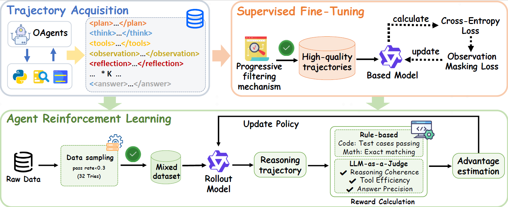

<div align="center">

<h2>Chain-of-Agents: End-to-End Agent Foundation Models via Multi-Agent Distillation and Agentic RL, OPPO PersonalAI Lab.</h2>

</div>

<div align="center">
  <a href='https://arxiv.org/abs/'></a>
  <a href='https://huggingface.co/collections/PersonalAILab/afm-689200e11d0b21a67c015ba8'></a>
  <a href='https://huggingface.co/collections/PersonalAILab/afm-datasets-6892140eaad360ea5ccdcde1'></a>
</div>

This is the official repository for our paper "Chain-of-Agents: End-to-End Agent Foundation Models via Multi-Agent Distillation and Agentic RL". Our work introduces a novel paradigm for LLM reasoning that enables end-to-end complex problem-solving within a single model, simulating multi-agent collaboration through dynamic activation of tool agents and role-playing agents.

<div align="center">
  
</div>

## Overview

Recent advances in large language models (LLMs) and multi-agent systems have demonstrated remarkable capabilities in complex problem-solving. However, existing multi-agent systems often rely on manual prompt engineering and sophisticated frameworks, leading to inefficiencies. 

We propose:
- **Chain-of-Agents (CoA)**: A paradigm enabling end-to-end complex problem-solving within one model
- **Agent Foundation Models (AFMs)**: Models trained through our multi-agent distillation framework and agentic reinforcement learning


## SFT Training

### Quick Start

#### Setup
```bash
conda create -n llama_factory python=3.10
conda activate llama_factory
pip install deepseed
pip install swanlab
cd LLaMA-Factory
pip install -e '.[torch,metrics]'
```

#### 1. Make script executable
```bash
chmod +x ./sft_scripts/dpo_qwen2.5_32b.sh
chmod +x ./sft_scripts/sft_qwen2.5_32b.sh
```

#### 2. Start training with default parameters

##### SFT script
```bash
bash ./sft_scripts/sft_qwen2.5_32b.sh
```

##### DPO script
```bash
bash ./sft_scripts/dpo_qwen2.5_32b.sh
```

##### Key Configurable Parameters

```
LEARNING_RATE="1e-6"
BATCH_SIZE=1 
GRADIENT_ACCUMULATION=8
EPOCHS=4.0
ignore_observation=true # Whether to mask content within special tokens
ignore_observation_token=observation # Specify special token
```
**Note: Check if special tokens are properly masked and data length is appropriate after starting.**

#### Default Parameter Configuration
| Parameter Name          | Default Value                                                   | Description                                                                 |
|-------------------------|-----------------------------------------------------------------|-----------------------------------------------------------------------------|
| MODEL_PATH              | xx                                                              | Path to the pretrained model. Defaults to the Qwen2.5-0.5B instruction model |
| OUTPUT_DIR              | saves/qwen2.5_32b                                               | Output directory for training results, including model weights, logs, and configuration files |
| LEARNING_RATE           | 1e-6                                                            | Learning rate for training. Suggested to adjust based on model size (for 0.5B models, 1e-6 ~ 5e-6 is recommended) |
| BATCH_SIZE              | 1                                                               | Batch size per device, limited by GPU memory (for 0.5B models on 16GB VRAM, set to 1–2) |
| GRADIENT_ACCUMULATION   | 8                                                               | Number of gradient accumulation steps, effectively increasing batch size (total batch = BATCH_SIZE × this value) |
| EPOCHS                  | 4.0                                                             | Number of training epochs. Suggested to adjust based on dataset size (4–8 epochs recommended for small to medium datasets) |
| PRECISION               | bf16                                                            | Training precision mode, options: bf16/fp16/fp32. BF16 mixed precision is default |
| CUDA_VISIBLE_DEVICES    | 1                                                               | Specifies GPU device ID to use (0-indexed). Defaults to the second GPU (device 1) |

### Additional Parameters
See: https://llamafactory.readthedocs.io/zh-cn/latest/advanced/arguments.html

#### Advanced Usage
Script defaults to second GPU (CUDA_VISIBLE_DEVICES=1). To modify:
- Edit CUDA_VISIBLE_DEVICES number in script
- Or set temporarily: CUDA_VISIBLE_DEVICES=0,1 bash sft_scripts/dpo_qwen2.5_32b.sh

#### Dataset Configuration
Data Format:
```bash
{
  "instruction": "Describe a process of making crepes.",
  "input": "",
  "chosen": "",
  "rejected": ""
}
```

### Special Token Masking Format:
```bash
Must have two newlines "\n\n" before <ignore_observation_token>
Must have two newlines "\n\n" after </ignore_observation_token>
Format: \n\n<ignore_observation_token> ... </ignore_observation_token>\n\n
```

#### Dataset Setup:
- Place dpo_demo.json in data directory
- Add dataset info to dataset_info.json:
```bash
"dpo_demo": {
  "file_name": "dpo_demo.json",
  "ranking": true,
  "formatting": "sharegpt",
  "columns": {
    "prompt": "instruction", 
    "query": "input",
    "chosen": "chosen",
    "rejected": "rejected"
  }
}
```

#### To modify dataset:
```bash
# Default
--dataset alpaca_en_demo
# Custom datasets (comma-separated)
--dataset your_dataset1,your_dataset2
```

#### Training Monitoring
- Logs output to output_dir/training.log
- SwanLab visualization (requires setup):
```bash
--swanlab_api_key xxx  # Your SWANLAB_API_KEY
--swanlab_project xxx  # Your SWANLAB_PROJECT
```

#### Complete Training Command Example:
```bash
CUDA_VISIBLE_DEVICES=1 llamafactory-cli train \
  --model_name_or_path "./qwen2.5/Qwen2.5-32B-Instruct" \
  --trust_remote_code \
  --stage dpo \
  --do_train \
  --finetuning_type full \
  --dataset dpo_demo \
  --template qwen \
  --cutoff_len 32768 \
  --output_dir "saves/qwen2.5_32b" \
  --per_device_train_batch_size 1 \
  --gradient_accumulation_steps 8 \
  --learning_rate 1e-6 \
  --num_train_epochs 4.0 \
  --bf16 \
  --save_only_model true \
  --report_to swanlab \
  --ignore_observation_token observation \
  --ignore_observation true
```

## RL Training

### Environment Setup

```bash
# Create virtual environment. 
conda create -n afm python=3.10.14 -y
conda activate afm

# Phase 1
cd verl
pip install -r requirements.txt

# Phase 2
pip install --force-reinstall protobuf==5.29.5
pip install --force-reinstall --no-deps grpcio-status==1.71.0 selenium==4.33.0

# Phase 3
cd ..
git clone https://github.com/NVIDIA/apex.git  
cd apex
python -m pip install -v --disable-pip-version-check --no-cache-dir --no-build-isolation --global-option="--cpp_ext" --global-option="--cuda_ext" ./
cd ..

# Phase 4
cd verl
pip install -r requirements_sglang.txt
cd ..
```

### Access to the main part of VeRL:
```bash
cd verl
```

### Tool Server Deployment

We have developed two server-side components to support web interactions:
- A web search server
- A page crawling server

For detailed deployment instructions, please refer to `server/tool_server_readme.md`.

### Python Sandbox Usage
Our Python executor leverages the powerful local isolation sandbox capabilities provided by [nsjail](https://github.com/google/nsjail). We greatly appreciate the nsjail project for enabling secure code execution.

To use this feature during training, you need to:

1. Clone and build nsjail
    ```bash
    git clone https://github.com/google/nsjail.git
    cd nsjail
    make
    ```
2. Add the absolute path to the nsjail_path in code tool configuration file `verl/tools/config/code_tool_config/code_executor.yaml`:
   ```yaml
   nsjail_path: /abs_path/to/your/nsjail/nsjail
   ```

### Configuration

1. Edit the `environment.sh` file and fill in your API keys and other required credentials
2. Apply the environment settings:
```bash
source environment.sh
```

### Training

To start a training run:

1. Edit `experiments/train_dapo_afm.sh` to specify your downloaded dataset and model
2. Chose the tools you want to use during training. We have developed three tools: web_search, craw_page and code_executor. `./verl/tools/config/search_tool_config/training_servers_config.yaml` is for web_search and crawl_page. `./verl/tools/config/code_tool_config/code_executor.yaml` is for code_executor. Please fill the corresponding config in the `actor_rollout_ref.rollout.multi_turn.tool_config_path` param to specify your tools.
2. Execute the training script:
```bash
bash experiments/train_dapo_afm.sh
```

### Evaluation

For generate trajectories only:

```bash
bash inference/inference.sh
```

If you want to evaluate the search agent model's capabilities, please download the corresponding model and validation datasets, then use the following command:

```bash
# MHQA
bash evaluation/inference_mhqa.sh
# Web agent
bash evaluation/run_qwen.sh
python inference_web_agent.py
```

If you want to evaluate the code agent model's capabilities, all related evaluation datasets are stored in the `data/code_math_benchmarks` folder. Please fill in the downloaded code agent model and validation datasets in `evaluation/eval_code_agent.sh`, then run:

```bash
bash evaluation/eval_code_agent.sh
```

In addition, if you want to evaluate livecodebench datasets, please use the scripts `data/livecodebench_testcases/download_and_process.py` to generate corresponding testcases. We would like to thank the [Skywork-OR1](https://github.com/SkyworkAI/Skywork-OR1) for their open-source evaluation code. Our evaluation implementation for math and code training sets was inspired by and adapted from their work.

### Dataset Processing

The `data/README.md` contains scripts and instructions for processing search agent model related data.

For code agent model, the validation datasets are already provided in the `data/code_math_benchmarks` folder, with corresponding processing instructions available in `data/code_math_benchmarks/README.md`.

The final dataset format is shown below and stored in .parquet: 
```python
{
    "data_source": data_source,
    "prompt": [
        {"role": "user", "content": sys_prompt + question}
    ],
    "reward_model": {
        "ground_truth": "{"target": answer, ...}"  # This is now a JSON string
    },
    "extra_info": {
        "need_tools_kwargs": True,
        "question": question,
        "answer": answer,
        "tools_kwargs": tools_kwargs
    }
}
```

## Acknowledgement
We would like to express our sincere gratitude to the original authors and contributors of LLaMA-Factory and verl, an excellent open-source project that provided a solid foundation for our work. Our implementation has been adapted from the [LLaMA-Factory](https://github.com/hiyouga/LLaMA-Factory) and [verl](https://github.com/volcengine/verl). 
Specifically, based on the LLaMA-Factory framework, we have modified the implementation of fine-tuning pipeline to support mask fine-tuning; while in the VeRL framework, we have enhanced it with functionalities: tool calling for reinforcement learning training, reward design, and related supporting features.

## Star

<div align="center">

[](https://github.com/OPPO-PersonalAI/Agent_Foundation_Models)

</div>