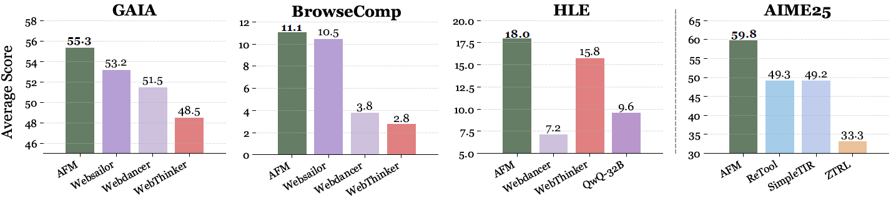
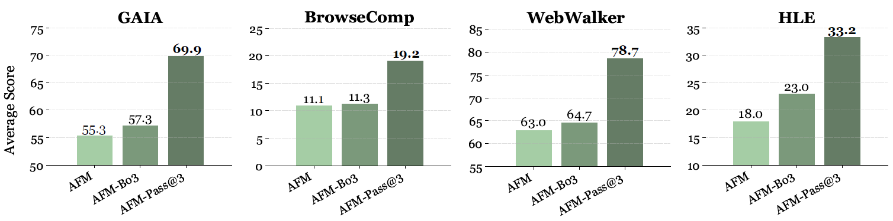
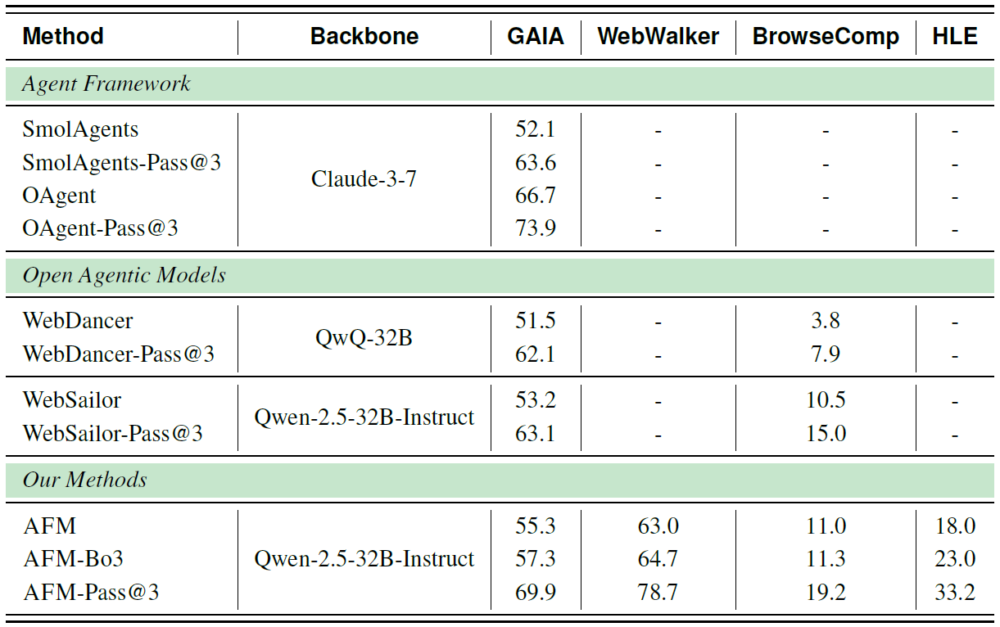

<div align="center">

<h2>Chain-of-Agents: End-to-End Agent Foundation Models via Multi-Agent Distillation and Agentic RL, OPPO PersonalAI Lab.</h2>

</div>

<div align="center">
  <a href='https://chain-of-agents-afm.github.io/'></a>
  <a href='https://raw.githubusercontent.com/OPPO-PersonalAI/Agent_Foundation_Models/refs/heads/main/assets/AFM.pdf'></a>
  <a href='https://huggingface.co/collections/PersonalAILab/afm-689200e11d0b21a67c015ba8'></a>
  <a href='https://huggingface.co/collections/PersonalAILab/afm-datasets-6892140eaad360ea5ccdcde1'></a>
</div>

This is the official repository for our paper "Chain-of-Agents: End-to-End Agent Foundation Models via Multi-Agent Distillation and Agentic RL". Our work introduces a novel paradigm for LLM reasoning that enables end-to-end complex problem-solving within a single model, simulating multi-agent collaboration through dynamic activation of tool agents and role-playing agents.

<div align="center">
  
</div>

# Overview
Recent advances in large language models (LLMs) and multi-agent systems have demonstrated remarkable capabilities in complex problem-solving. However, existing multi-agent systems often rely on manual prompt engineering and sophisticated frameworks, leading to inefficiencies. 

We propose:
- **Chain-of-Agents (CoA)**: A paradigm enabling end-to-end complex problem-solving within one model
- **Agent Foundation Model (AFM)**: Model trained through our multi-agent distillation framework and agentic reinforcement learning

# SOTA Performance

<div align="center">
  
</div>

We present the **Chain-of-Agents Distillation framework**, a novel approach that significantly advances the capabilities of LLMs. By applying CoA distillation pipeline to Qwen-2.5 series models, we developed the Aengt Foundation Model (AFM), which achieves state-of-the-art performance across multiple benchmarks. For instance, our 32B AFM model reaches an average success rate of **55.3%** (**Pass@1**) on the GAIA benchmark. It also scores **11.1%** on BrowseComp, **63.0%** on WebWalker, and **18.0%** on HLE. The effectiveness of CoA distillation is further demonstrated by our 7B model, which achieves a remarkable **15.6%** on HLE.

<div align="center">
  
</div>


<div align="center">
  
</div>

Test-time scaling also significantly enhances AFM's performance across all benchmarks: **AFM-Bo3** achieves **57.3%** on GAIA, **64.7%** on WebWalker, **11.3%** on BrowseComp and **23.0%** on HLE, while **AFM-Pass@3** reaches **69.9%** on GAIA, **78.7%** on WebWalker, **19.2%** on BrowseComp, and **33.2%** on HLE.

We fully open-source our data, model, and training and inference code to ensure the reproducibility of our results. For more details, please refer to our [Technical Report](https://github.com/OPPO-PersonalAI/Agent_Foundation_Models/blob/main/assets/AFM.pdf).

# Quick Feature Summary
| Feature Category | Supported Capabilities|
| - | - |
| **Core Paradigm**          | ✅ Chain-of-Agents (CoA) for end-to-end problem-solving<br>✅ Single-model simulation of multi-agent collaboration<br>✅ Dynamic activation of tool agents and role-playing agents |
| **Training Framework**               | ✅ Multi-Agent Distillation pipeline<br>✅  Agentic Reinforcement Learning support<br>✅ Mask fine-tuning for selective learning |
| **Agent Capabilities**    | ✅ Web interaction (Web Agent)<br>✅ Multi-hop question answering (MHQA Agent)<br>✅ Code execution (Code Agent) |
| **Tool Integration**            | ✅ Web search and crawling servers<br>✅ Secure code sandbox (via nsjail) <br>✅ Configurable multi-tool collaboration |
| **Evaluation**        | ✅ Multi-scenario benchmark testing<br>✅ Custom reward model integration<br> |


# Table of Contents
- [Running Examples](#running-examples)
  - [Training](#training)
    - [Supervised Fine-tuning](#supervised-fine-tuning)
      - [1. Env Setup](#1-env-setup)
      - [2. Prepare SFT Dataset](#2-prepare-sft-dataset)
      - [3. Start training with default parameters](#3-start-training-with-default-parameters)
    - [Reinforcement Learning](#reinforement-learning)
      - [1. Env Setup](#1-env-setup-1)
      - [2. Tool usage](#2-tool-usage)
        - [2.1 Search Servers](#21-search-servers)
        - [2.2 Code Server(s)](#22-code-servers)
      - [4. Configuration](#4-configuration)
      - [5. Dataset Processing](#5-dataset-processing)
      - [6. Training](#6-training)
  - [Evaluation](#evaluation)
    - [Multi Hop QA (MHQA) Evaluation](#multi-hop-qa-mhqa-evaluation)
    - [Web Agent Evaluation](#web-agent-evaluation)
    - [Code Agent Evaluation](#code-agent-evaluation)
- [Acknowledgement](#acknowledgement)
- [Citation](#citation)
- [Star](#star)


# Running Examples
## Training
### Supervised Fine-tuning
#### 1. Env Setup
```bash
conda create -n llama_factory python=3.10
conda activate llama_factory
pip install deepspeed
pip install swanlab
cd LLaMA-Factory
pip install -e '.[torch,metrics]'
```

#### 2. Prepare SFT Dataset
Download SFT Dataset for Web/MHQA/Code Agent:
```py 
python ./AFM/data/web_agent/download.py 
python ./AFM/data/mhqa_agent/download.py 
python ./AFM/data/code_agent/download.py 
```

Add the downloaded dataset filepath to `LLaMA-Factory/data/dataset_info.json`, for example:
```json
"code_agent_sft": {
  "file_name": "path/to/downloaded/AFM-WebAgent-SFT-Dataset/WebAgentSFTDataset.json"
}
```

#### 3. Start training with default parameters
The training scripts are list in `./train`. 
Example of sft for code agent:
```bash
bash ./AFM/train/code_agent/sft/sft_qwen2.5_7b.sh
```

Note `DATA_DATA` in the training bash script should be the key in `LLaMA-Factory/data/dataset_info.json`, like `web_agent_sft`, `mhqa_agent_sft`, `code_agent_sft`.

Logs output to output_dir/training.log. We use [SwanLab](https://swanlab.cn/) for visualization (requires setup):
```bash
--swanlab_api_key xxx  # Your SWANLAB_API_KEY
--swanlab_project xxx  # Your SWANLAB_PROJECT
```

Key Configurable Parameters
```
ignore_observation=true # Whether to mask content within special tokens
ignore_observation_token=observation # Specify special token
```
**Note: Check if special tokens are properly masked and data length is appropriate after starting.**

### Reinforement Learning
#### 1. Env Setup
```bash
# Create virtual environment. 
conda create -n afm python=3.10.14 -y
conda activate afm

# Phase 1
cd verl
pip install -r requirements.txt

# Phase 2
pip install --force-reinstall protobuf==5.29.5
pip install --force-reinstall --no-deps grpcio-status==1.71.0 selenium==4.33.0

# Phase 3
cd ..
git clone https://github.com/NVIDIA/apex.git  
cd apex
python -m pip install -v --disable-pip-version-check --no-cache-dir --no-build-isolation --global-option="--cpp_ext" --global-option="--cuda_ext" ./
cd ..

# Phase 4
cd verl
pip install -r requirements_sglang.txt
cd ..
```


#### 2. Tool usage
##### 2.1 Search Servers
We have developed two server-side components to support web interactions:
- A web search server
- A page crawling server

For detailed deployment instructions, please refer to `AFM/tool_servers/tool_server_readme.md`.


##### 2.2 Code Server(s)
Our Python executor leverages the powerful local isolation sandbox capabilities provided by [nsjail](https://github.com/google/nsjail). We greatly appreciate the nsjail project for enabling secure code execution.

To use this feature during training, you need to:

1. Clone and build nsjail
    ```bash
    git clone https://github.com/google/nsjail.git
    cd nsjail
    make
    ```
2. Add the absolute path to the nsjail_path in code tool configuration file `verl/verl/tools/config/code_tool_config/code_executor.yaml`:
   ```yaml
   nsjail_path: /abs_path/to/your/nsjail/nsjail
   ```


#### 4. Configuration
1. Edit the `environment.sh` file and fill in your API keys and other required credentials
2. Apply the environment settings:
```bash
source environment.sh
```

#### 5. Dataset Processing
The `./AFM/data/README.md` contains scripts and instructions for processing search agent model related data.

For code agent model, the validation datasets are already provided in the `./AFM/data/code_agent/code_math_benchmarks` folder, with corresponding processing instructions available in `./AFM/data/code_agent/code_math_benchmarks/README.md`.

The final web_agent and mhqa_agent dataset format is shown below and stored in .parquet: 
```python
{
    "data_source": data_source,
    "prompt": [
        {"role": "user", "content": sys_prompt + question}
    ],
    "reward_model": {
        "ground_truth": {"target": answer}
    },
    "extra_info": {
        "need_tools_kwargs": True,
        "question": question,
        "answer": answer,
        "tools_kwargs": tools_kwargs
    }
}
```


#### 6. Training
To start a training run:

1. All Agentic-RL script examples are listed:
    -  Web Agent: `./AFM/train/web_agent/rl/train_dapo_web_agent.sh`
    -  Code Agent: `./AFM/train/code_agent/rl/train_dapo_code_agent.sh`
    -  MHQA Agent: `./AFM/train/mhqa_agent/rl/train_ppo_mhqa_agent.sh`
2. Edit the corresponding script to specify your downloaded dataset and model
3. Make sure you have already fill in the `environment.sh` and source
4. All tool configs are listed and have been specified in training scripts: 
    - web_search and crawl_page: `verl/verl/tools/config/search_tool_config/training_servers_config.yaml`
    - code_executor: `verl/verl/tools/config/code_tool_config/code_executor.yaml`
    - wiki_search: `verl/verl/tools/config/search_tool_config/wiki_rag_config.yaml`
    - all_tools: `verl/verl/tools/config/afm_tool_config/afm_tool_config.yaml`
5. Execute the training script like:
```bash
bash ./AFM/train/web_agent/rl/train_dapo_web_agent.sh
```


## Evaluation
### Multi Hop QA (MHQA) Evaluation
1. To evaluate MHQA datasets, you should first download the AFM-MHQA-Agent-7B-rl model and test datasets
2. Transform the test dataset to parquet format.
```bash
cd ./AFM/data/mhqa_agent
bash ./prepare.sh
```
3. Then fill the corresponding dataset and model in scripts below and run
  ```bash
  bash evaluation/inference_mhqa.sh
  ```


### Web Agent Evaluation
1. To evaluate web agent, you should first download the AFM-WebAgent-32B-RL checkpoint (or your own) and test dataset.
2. Set environment variable `source environment.sh`.
3. Set `model_path` in the `run_qwen.sh` script, and serve the model with the following command `./AFM/evaluation/web_agent/run_qwen.sh`. After several minutes, the script will output like `URL Endpoint: http://10.77.225.92:10000/v1`.
4. Choose from available test sets in `./AFM/data/web_agent/test_benchmarks`: gaia, hle, webwalker, browsercomp.
5. Finally, set `URL` in `inference_web_agent.py` according to step3, and execute the python script to start webagent inference and evaluation.

```bash
python ./AFM/evaluation/web_agent/inference_web_agent.py \
    --infile  ./AFM/data/web_agent/test_benchmarks/gaia_dev_103.json \
    --outfile ./AFM/evaluation/web_agent/results/webagent_out.jsonl
```


### Code Agent Evaluation
1. All math and code related evaluation datasets are stored in the `./AFM/data/code_agent/code_math_benchmarks` folder. 
2. Please fill in the downloaded code agent model AFM-CodeAgent-32B-rl and validation datasets in `./AFM/evaluation/code_agent/eval_code_agent.sh`
3. Make sure you have build nsjail code sandbox and fill in the corresponding config. Then run

```bash
bash ./AFM/evaluation/code_agent/eval_code_agent.sh
```

In addition, if you want to evaluate livecodebench datasets, please use the scripts `./AFM/data/code_agent/livecodebench_testcases/download_and_process.py` to generate corresponding testcases. We would like to thank the [Skywork-OR1](https://github.com/SkyworkAI/Skywork-OR1) for their open-source evaluation code. Our evaluation implementation for math and code training sets was inspired by and adapted from their work.


# Acknowledgement
We would like to express our sincere gratitude to the original authors and contributors of LLaMA-Factory and verl, an excellent open-source project that provided a solid foundation for our work. Our implementation has been adapted from the [LLaMA-Factory](https://github.com/hiyouga/LLaMA-Factory) and [verl](https://github.com/volcengine/verl). 
Specifically, based on the LLaMA-Factory framework, we have modified the implementation of fine-tuning pipeline to support mask fine-tuning; while in the VeRL framework, we have enhanced it with functionalities: tool calling for reinforcement learning training, reward design, and related supporting features.


## Citation
If you find `AFM` useful in your research or applications, we would appreciate it if you could cite our work:
```bibtex
@article{chain-of-agents-2025,
  title={Chain-of-Agents: End-to-End Agent Foundation Models via Multi-Agent Distillation and Agentic RL},
  author={OPPO PersonalAI Lab},
  journal={arXiv preprint arXiv:xxxx.xxxxx},
  year={2025}
}
```

# Star
<div align="center">

[](https://github.com/OPPO-PersonalAI/Agent_Foundation_Models)

</div>