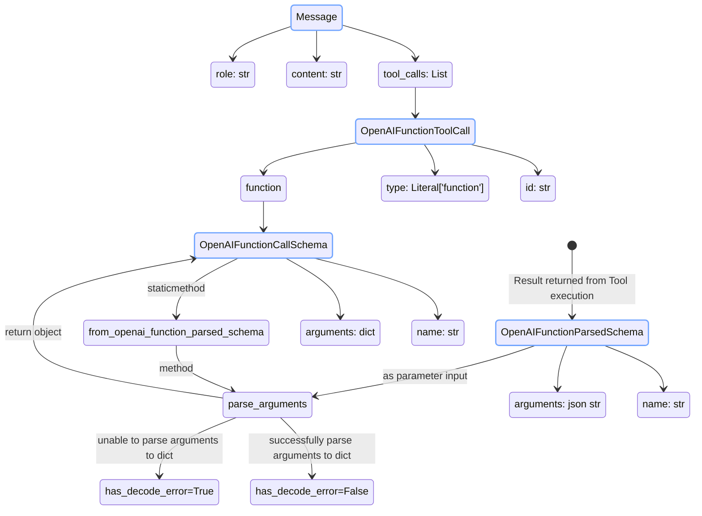
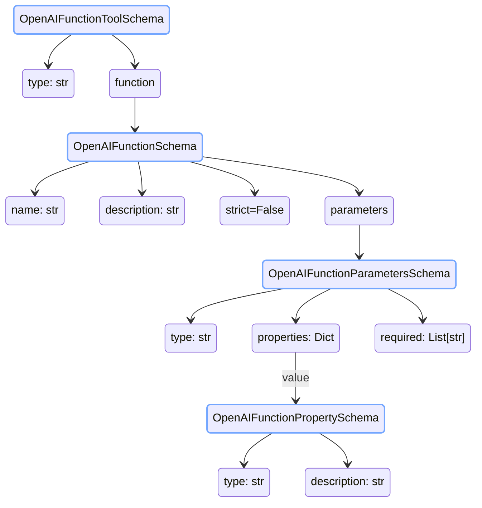
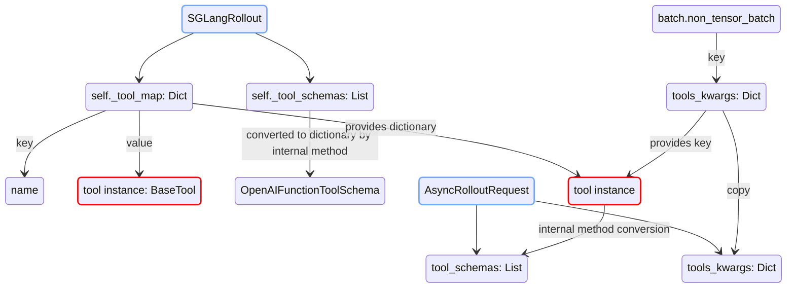
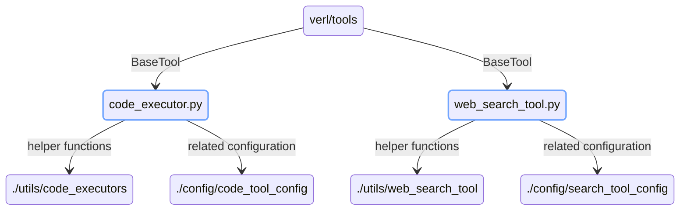

# Basic Protocol

The basic protocols are defined in `verl.tools.schemas.py`

### 1. Tool Call Schema

### 2. Tool Function Schema

### 3. Base Tool

## Tool Instances in Rollout Process

### 1. Rollout

## Tools Overview

